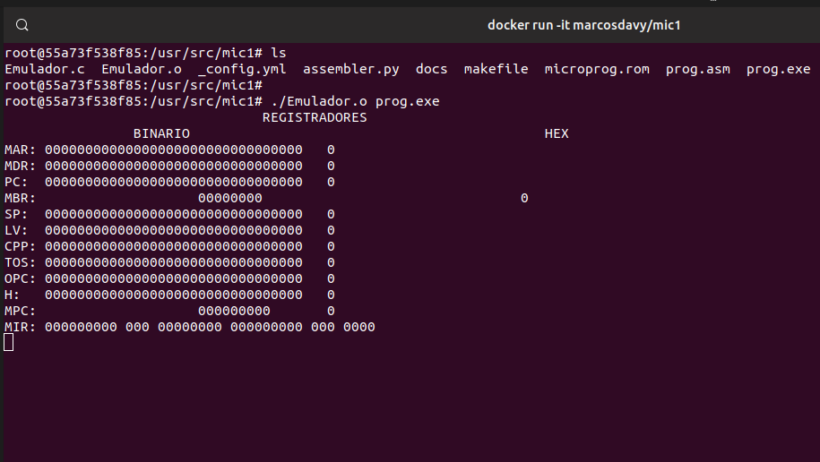

# MIC1
> Emulador para MIC-1 e Assembler para a linguagem MAC-1.

<!-- [![NPM Version][npm-image]][npm-url] -->
<!-- [![Build Status][travis-image]][travis-url] -->
<!-- [![Downloads Stats][npm-downloads]][npm-url] -->

O Programa deve emular uma microarquitetura IJVM, um subconjunto das instruções de uma JVM que lida somente com inteiros. Nosso programa deve conter um microprograma capaz de buscar, decodificar e executar instruções IJVM.



## Instalação

Emulador:

```sh
# compila o Emulador.c e gera o executavel Emulador
make

 # executa o emulador com o programa prog.exe passado como argumento.
./Emulador prog.exe
```

Assembler:

```sh
# executa o assembler para montagem do arquivo prog.asm
python3 assembler.py prog.asm
```

com Docker:
```sh
# executa um container com a imagem do projeto e suas depedencias (assemlber e emulador)
docker run -it marcosdavy/mic1:latest
# dentro do container, voce podera tanto montar o assembler com
python3 assembler.py prog.asm
# como tambem executar o emulador com o binario gerado pelo assembler
./Emulador.o prog.exe
```

## Exemplo de uso

_Para mais informações, consulte a [especificação](docs/especificacao.md)._

## Configuração para Desenvolvimento

Requesitos:

- GCC
- Python3
- Docker (opcional)
- Algum editor de texto

Escreva um arquivo em assembly mac-1, monte-o pelo assembler e o execute pelo emulador.
Compile os arquivos como descrito na seção de instalação.

## Histórico de lançamentos

- 0.0.1
  - Trabalho em andamento

## Info

<!-- Seu Nome – [@SeuNome](https://twitter.com/...) – SeuEmail@exemplo.com -->
Equipe:

- André Brizzante Cintra
- Daniel Rebouças de Queiroz
- Davi Bessa steindorfer
- David Lael Barroso Teixeira
- Diego Freitas Holanda
- Eduardo Alcântara de Alencar Pinto
- Felipe Rodrigues Keiler
- Marcos Davy Guedes Dias
- Pedro Ernesto de Oliveira Primo

Distribuído sob a licença MIT. Veja `LICENSE` para mais informações.

<!-- [https://github.com/yourname/github-link](https://github.com/othonalberto/) -->

## Contributing

1. Faça o _fork_ do projeto (<https://github.com/DavyGuedes/mic1/fork>)
2. Crie uma _branch_ para sua modificação (`git checkout -b feature/fooBar`)
3. Faça o _commit_ (`git commit -am 'Add some fooBar'`)
4. _Push_ (`git push origin feature/fooBar`)
5. Crie um novo _Pull Request_

<!-- [npm-image]: https://img.shields.io/npm/v/datadog-metrics.svg?style=flat-square -->
<!-- [npm-url]: https://npmjs.org/package/datadog-metrics -->
<!-- [npm-downloads]: https://img.shields.io/npm/dm/datadog-metrics.svg?style=flat-square -->
<!-- [travis-image]: https://img.shields.io/travis/dbader/node-datadog-metrics/master.svg?style=flat-square -->
<!-- [travis-url]: https://travis-ci.org/dbader/node-datadog-metrics -->
<!-- [wiki]: https://github.com/seunome/seuprojeto/wiki -->
